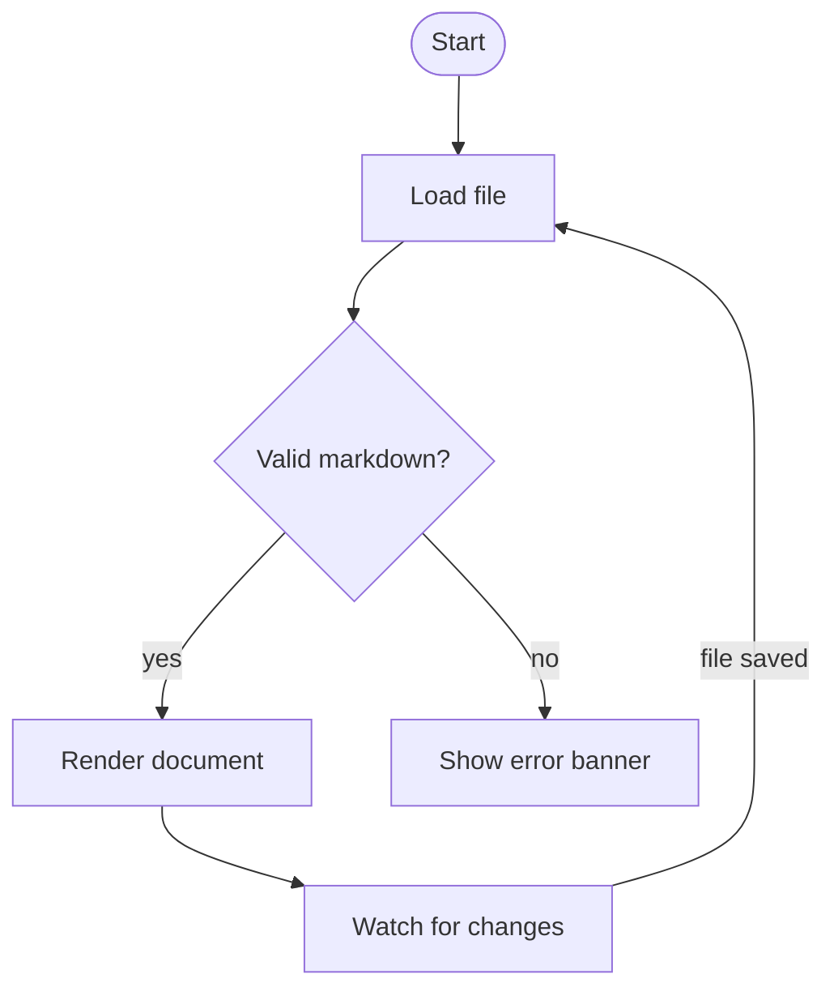
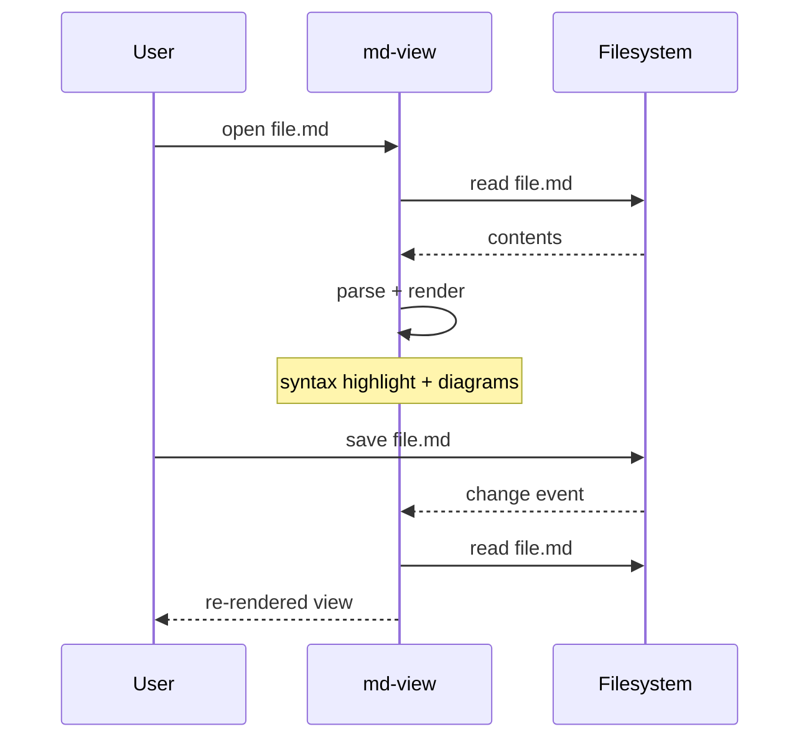

# md-view Demo

## Headers

### Level 3 heading

#### Level 4 heading

A short paragraph under the headers, with **bold**, *italic*, `inline code`,
~~strikethrough~~, ==highlighted==, ++inserted++, and a [link](https://example.test).

## Code Blocks

```rust
fn fibonacci(n: u32) -> u64 {
    // Iterative to avoid recursion overhead.
    let (mut a, mut b) = (0u64, 1u64);
    for _ in 0..n {
        let next = a + b;
        a = b;
        b = next;
    }
    a
}

fn main() {
    println!("fib(10) = {}", fibonacci(10));
}
```

```json
{
    "name": "md-view",
    "version": "0.1.0",
    "tags": ["markdown", "viewer", "gpui"],
    "stable": true,
    "max_lines": 10000
}
```

```bash
#!/usr/bin/env bash
set -euo pipefail

echo "Building project..."
cargo build --release
```

## Flowchart



## Sequence Diagram



## Table

| Feature     | Status | Notes                  |
|-------------|:------:|------------------------|
| Headings    |   ✅   | Sized + colored        |
| Code blocks |   ✅   | Syntect highlighting   |
| Mermaid     |   ✅   | Flowchart + sequence   |
| Tables      |   ✅   | Aligned, zebra striped |

## Task List

- [x] Parse markdown
- [x] Render diagrams
- [ ] Add more languages
