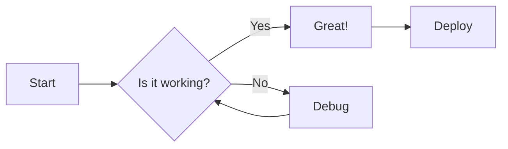
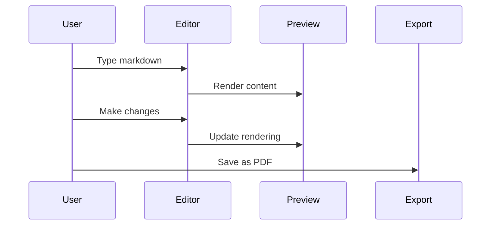

# Welcome to Markdown Viewer

## ✨ Key Features
- **Split-Screen Live Markdown Preview** with GitHub-Flavored Markdown and sync scroll
- **Open Local .md and .markdown Files** by picker or drag and drop
- **Smart Import/Export** (Markdown, HTML, PDF, PNG)
- **Insert Diagram & More** for Mermaid, PlantUML, Graphviz, D2, Vega-Lite, WaveDrom, Markmap, maps, STL, and ABC notation
- **LaTeX Math Support** for scientific notation
- **Share Snapshot and Live Share** for quick Markdown sharing workflows
- **No login required** for editing, preview, autosave, local file import, settings, and most exports
- **Emoji Support** 😄 👍 🎉

## 💻 Code with Syntax Highlighting
```javascript
  function renderMarkdown() {
    const markdown = markdownEditor.value;
    const html = marked.parse(markdown);
    const sanitizedHtml = DOMPurify.sanitize(html);
    markdownPreview.innerHTML = sanitizedHtml;
    
    // Syntax highlighting is handled automatically
    // during the parsing phase by the marked renderer.
    // Themes are applied instantly via CSS variables.
  }
```

## 🧮 Mathematical Expressions
Write complex formulas with LaTeX syntax:

Inline equation: $$E = mc^2$$

Display equations:
$$\frac{\partial f}{\partial x} = \lim_{h \to 0} \frac{f(x+h) - f(x)}{h}$$

$$\sum_{i=1}^{n} i^2 = \frac{n(n+1)(2n+1)}{6}$$

## 📊 Mermaid Diagrams
Create powerful visualizations directly in markdown:



### Sequence Diagram Example


## 📋 Task Management
- [x] Create responsive layout
- [x] Implement live preview with GitHub styling
- [x] Add syntax highlighting for code blocks
- [x] Support math expressions with LaTeX
- [x] Enable mermaid diagrams

## 🆚 Feature Comparison

| Feature                  | Markdown Viewer (Ours) | Other Markdown Editors  |
|:-------------------------|:----------------------:|:-----------------------:|
| Live Preview             | ✅ GitHub-Styled       | ✅                     |
| Sync Scrolling           | ✅ Two-way             | 🔄 Partial/None        |
| Mermaid Support          | ✅                     | ❌/Limited             |
| LaTeX Math Rendering     | ✅                     | ❌/Limited             |

## 📝 Text Formatting Examples

### Text Formatting

Text can be formatted in various ways for ~~strikethrough~~, **bold**, *italic*, or ***bold italic***.

For highlighting important information, use <mark>highlighted text</mark> or add <u>underlines</u> where appropriate.

### Superscript and Subscript

Chemical formulas: H<sub>2</sub>O, CO<sub>2</sub>  
Mathematical notation: x<sup>2</sup>, e<sup>iπ</sup>

### **Lists**

Create bullet points:
* Item 1
* Item 2
  * Nested item
    * Nested further

### **Links and Images**

Add a [link](https://github.com/ThisIs-Developer/Markdown-Viewer) to important resources.

### **Blockquotes**

Quote someone famous:
> "The best way to predict the future is to invent it." - Alan Kay

---

## 🛡️ Security Note

Markdown Viewer keeps normal editing, previewing, and autosave on your device. Content can leave your device only when you use network features such as GitHub import, remote diagram rendering, Share Snapshot, Live Share, external images, or CDN-hosted libraries.